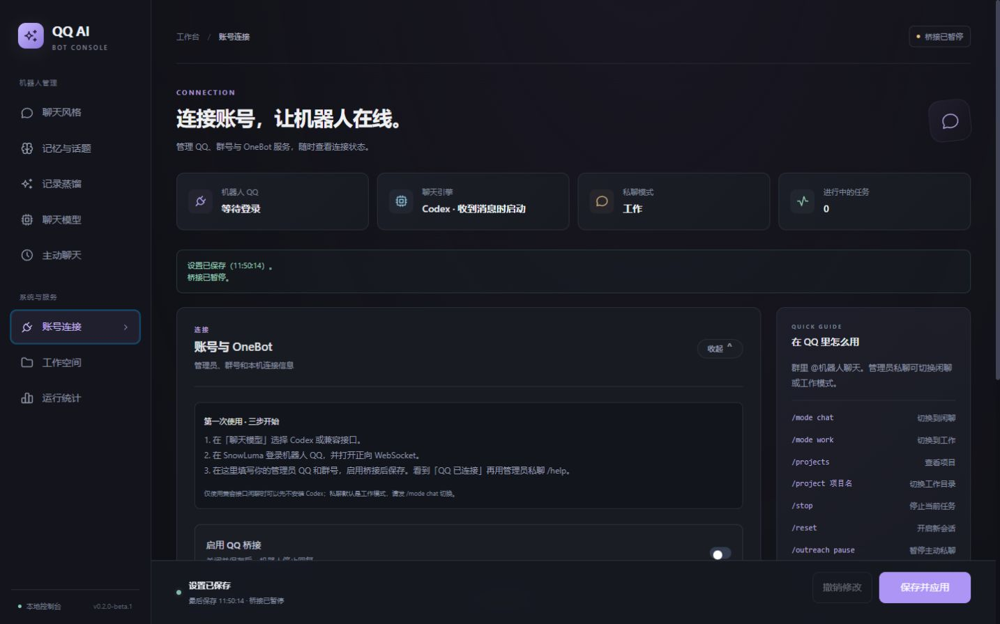

# QQ Codex Bridge

[](https://github.com/pinkman987/qq-codex-bridge/actions/workflows/ci.yml)

[源码仓库](https://github.com/pinkman987/qq-codex-bridge) · [下载测试版](https://github.com/pinkman987/qq-codex-bridge/releases)

本机运行的 QQ AI 聊天与管理员工作桥接。聊天可选择 Codex 登录或 OpenAI 兼容接口；管理员项目任务使用 Codex。聊天、群聊和项目任务分开处理，控制台管理连接、人设、记忆、主动聊天和记录蒸馏。

**0.2.0-beta.1 · Windows 10/11 本地公开测试版。** 需要 Node.js 22.13+，自行准备 QQ/OneBot 和模型服务。当前不是免配置的云服务，也不包含 QQ 或 SnowLuma。尚需其他电脑上的真实账号验收，见 [发布验收](docs/RELEASE.md)。

**源码更新（2026-10-03）：** 主分支包含回复稳定性修复、可配置记忆预算与消息聚合、独立语音转写和 Qwen3.8 Omni 原生多模态聊天。现有 Release ZIP 保持原版本内容；使用新增功能请更新源码、保留本机配置与会话，并重启桥接后台。详见[更新记录](CHANGELOG.md)和[Omni 配置](docs/COMPANION.md)。

## 开始使用

下载发布 ZIP 后解压，双击 `start.cmd`，首次自动安装依赖并打开控制页。下载源码时：

```powershell
npm ci
npm start
```

1. 按首次引导，在「聊天模型」选择 Codex 或兼容接口。
2. 单独安装 [SnowLuma](https://github.com/SnowLuma/SnowLuma/releases/latest)，登录机器人 QQ 并打开 OneBot v11 正向 WebSocket。
3. 在账号连接填写自己的管理员 QQ、群号、地址和连接令牌，启用桥接并保存。
4. 看到「QQ 已连接」后，管理员私聊 `/help`，群里 @机器人。仅使用 API 闲聊请先发送 `/mode chat`。

[完整首次安装](docs/QUICKSTART.md) · [故障排查与升级](docs/TROUBLESHOOTING.md) · [详细功能](docs/FEATURES.md) · [记忆、聚合与语音配置](docs/COMPANION.md)



[手机布局示例](docs/images/first-run-mobile.jpg)。截图来自空白测试配置，没有真实 QQ、密钥或聊天内容。

## 支持的功能

| 功能 | 支持范围 |
| --- | --- |
| QQ 聊天 | 白名单群 @ 回复、可控主动插话、管理员私聊；连续消息合并和排队 |
| 模型 | Codex 登录、OpenAI 兼容 API；部分 Anthropic 路径自动适配；密钥留空保留 |
| 项目任务 | 管理员工作模式、项目切换、停止任务、按次工具审批 |
| 记忆 | 各群/私聊独立，有限上下文、可编辑长期记忆和待续话题 |
| 主动私聊 | 时段与静默条件、每日上限、没有回复不追发 |
| 图片/表情/语音 | 表情上下文、视觉理解；可选 Qwen3.8 Omni 直接理解图片/语音，或独立语音转写，默认关闭 |
| 讲题 | 管理员 /讲题 或 /ti，/退出讲题 或 /unti；图片需要视觉接口 |
| 记录蒸馏 | 粘贴、结构化文件、SnowLuma 库、Windows OCR；先校对再发送模型 |
| 长记录 | 不设 2000 条上限，分块分析与分层归并；仍受 64 MiB/像素/30 分钟时限约束 |
| 控制台 | 八个设置分区、固定保存栏、在线状态、配置冲突保护、手机布局、本机环境检查 |
| 统计 | 调用、延迟、失败、服务返回的 token；未知用量明确显示未知 |

## 数据与权限

控制页只监听 `127.0.0.1`，随机令牌鉴权；不要分享带 `#` 令牌的地址。桥接默认暂停。实际设置和密钥在 `config.json`，会话、记忆及默认工作目录在 `state/`，升级前备份，禁止上传到公开仓库。

OCR 在本地完成，校对确认后记录才发送给所选模型；普通聊天、记忆上下文和主动判断也会发送给该服务。Codex 使用自己的登录账户额度，API 使用填写的 Key 额度。

聊天引擎没有操作工具，工作任务通过管理员审批。项目沙箱不等于完整系统容器。语音需要另行配置兼容识别服务，文件和复杂转发尚不提供完整理解；模型输出可能错误，记忆与蒸馏结果可以人工修正。见 [安全与隐私](SECURITY.md)。

## 检查与开发

```powershell
npm run doctor                         # 本机诊断，不调用模型或发 QQ 消息
npm run doctor -- --engines --work      # 可选 Codex 登录与协议检查
npm run check                          # 模板、语法、界面元素、版本
npm test                               # 模拟服务的行为与故障测试
npm run smoke                          # 全新临时目录的模拟聊天链路
npm run release                        # 干净 ZIP 与 SHA-256 校验
```

Core 服务在其他平台可进行模拟检查；Windows OCR 之外的平台功能未承诺真实 QQ 可用。CI 配置包含 Windows/Ubuntu、Node 22.13/24 的模拟检查，实际云端结果以上传后执行为准。CLI 协议基线为 Codex 0.153.4，新版本先做诊断。

[贡献说明](CONTRIBUTING.md) · [更新记录](CHANGELOG.md) · [发布流程](docs/RELEASE.md)

## 许可与素材

桥接代码 [MIT](LICENSE)。前端使用本地 Pico CSS 与 Tabler Icons，运行依赖 ws，来源和许可见 [第三方声明](THIRD-PARTY-NOTICES.md)。SnowLuma、QQ 和 Codex 独立安装，适用各自许可与条款；本项目 MIT 许可不覆盖它们。
